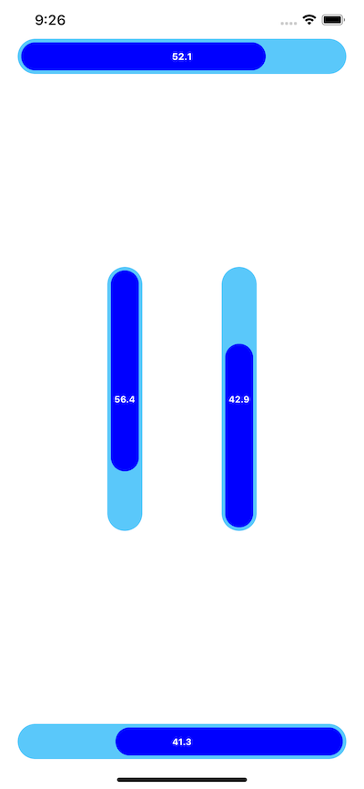

# Pipe Slider
## Overview
The PipeSlider is pipe like slider at horizontal and vertical direction.

## Swift Version
For using swift version `4.0`  

## Setup
### Install using Cocoapods (recommended)
1. Add  `pod 'PipeSlider', '~> 1.0.0'`  to your podfile and run `pod install`
2. Create a UIView and set it's class to PipeSlider at the storyboard or create from your code just like a UIView.
3. Set `direction` from topDown, bottomUp, leftToRight, or rightToLeft

> To install without Cocoapods, add the `PipeSlider` directory found in `PipeSlider/PipeSlider/` then follow steps 2 and 3.

## Features
### Delegate
You can set a delegate and listen to value change event.

|Delegate method|Description|
|---|---|
|`func pipeView(_ sender: PipeSlider, didChanged value: Double)`| User moved the slider|

### Customize
You can change Inset, pipeColor, textColor, and direction.

## License
This project is made available with the MIT License.

## Feedback
If you have any issues or feature request for this project, please create an issue and/or send us a pull request.

We hope you enjoy the PipeSlider!#  

